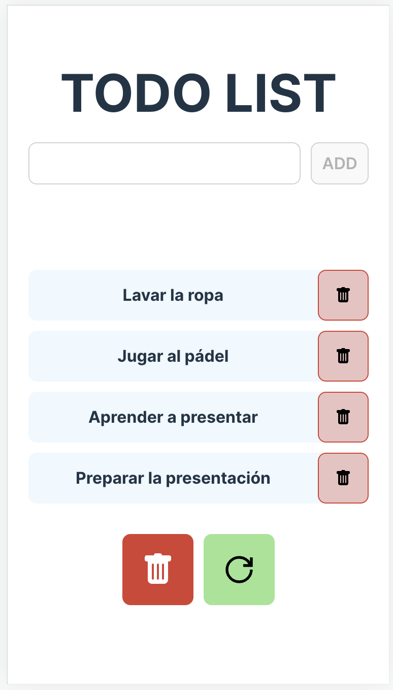
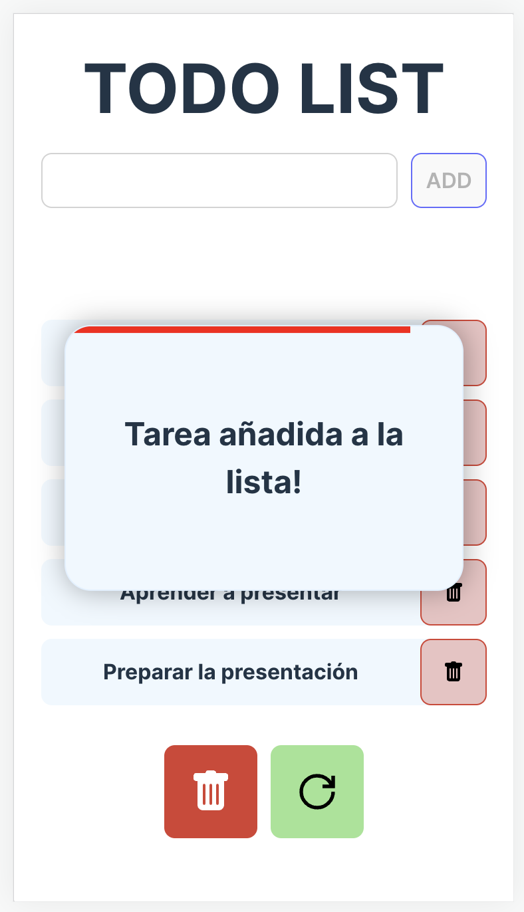
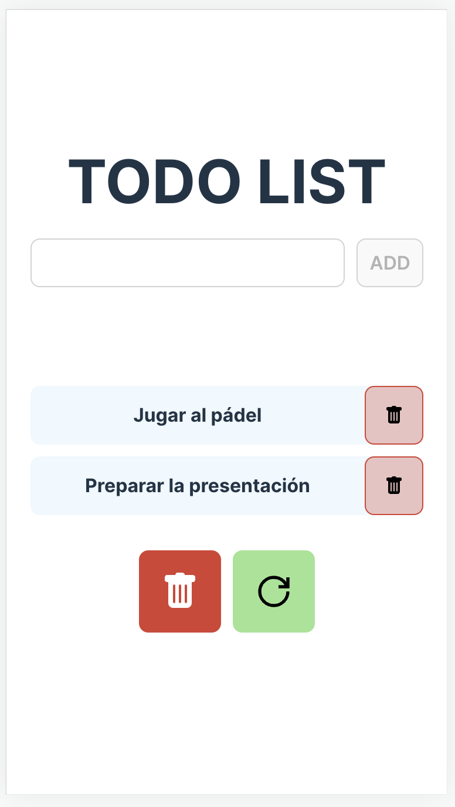
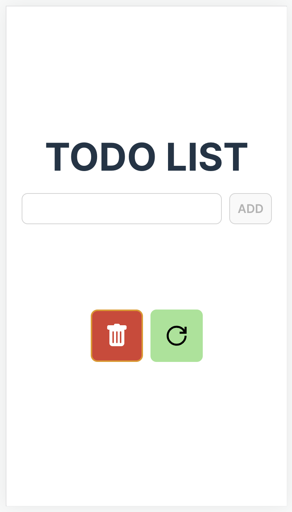

# Weather App

Aplicación desarrollada en la librería `React`, usando `useState` y `useEffect`, `just-debounce-it`.

## Uso

Una aplicación para controlar las tareas pendientes, sin persistencia de datos y que carga de un JSON al incializarse

## Contenido

- [Vista general](#vista-general)
  - [Capturas de pantalla](#capturas-de-pantalla)
  - [Links](#links)
- [Proceso](#proceso)
  - [Tecnologías de desarrollo](#tecnologías-de-desarrollo)
  - [A mejorar](#a-mejorar)
- [Desarrollo](#desarrollo)
- [Autor](#autor)

## Vista general

En esta pequeña aplicación, el usuario podrá:

- Añadir tareas a placer
- Borrar una tarea en concreto
- Borrar todas las tareas
- Regenerar las tareas iniciales

### Capturas de pantalla






### Links

- [Repositorio de GitHub](https://github.com/aerozfx/todo-list-react)
- [Demo](https://dainty-florentine-ac2f10.netlify.app/)

## Proceso

### Tecnologías de desarrollo

- Uso de HTML5 semántico
- CSS personalizado
- Flexbox
- Aplicación desarrollada siguiendo la estrategia de diseño `mobile first`
- [React](https://reactjs.org/) - JS library

### A mejorar

Añadir la bibloteca `sweet-alert` para el modal al añadir tareas

## Desarrollo

En caso de que quieras personalizar a tu manera este proyecto, puedes hacerlo de la siguiente manera

Para instalar las dependencias necesarias, primero deberemos ejecutar `npm install` en nuestra terminal

```console
  npm install
```

Una vez se hayan instalado las dependencias necesarias, para ejecutar nuestro servidor en tiempo real debemos usar `npm run dev`

```console
  npm run dev
```

Para comprobar nuestra aplicación en su versión de producción podemos usar `npm run build`

```console
  npm run build
```

Si queremos ver nuestra aplicación tal y como se va a subir a producción debemos usar `npm run preview`

```console
npm run preview
```

Las imágenes o SVG que se usen, se deberán colocar en la carpeta `./public`. Ya que al preparar la aplicación para producción, usa esa ruta de manera predeterminada.

## Autor

- Website - [Fernando Mariño](https://github.com/aerozfx)
